# Attribution
This project uses various fonts and icons, each with specific licensing terms. Below is a breakdown of the sources and their respective licenses. Please ensure compliance with these licenses when using or redistributing the assets.

## Font Faces
| Name | License |
|---------------------------------------------------------------------------------------------------------------|---------------------------------------------------------------------------------------|
[Jost by Owen Earl](https://fonts.google.com/specimen/Jost) | [SIL OFL v1.1](https://fonts.google.com/specimen/Jost/license) |

## Icons
| Name | Attribution |
|---------------------------------------------------------------------------------------------------------------|---------------------------------------------------------------------------------------|
| 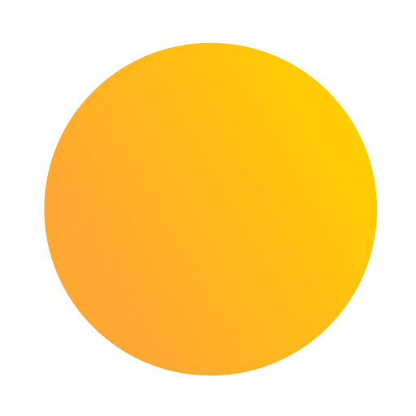 | <a href="https://www.flaticon.com/free-icons/gradient" title="gradient icons">Gradient icons created by jeremie ROBERRINI-NEVEU - Flaticon</a>|
|  | <a href="https://www.flaticon.com/packs/weather-app-8" title="color fill">Color fill created by Arkinasi - Flaticon</a>|
| 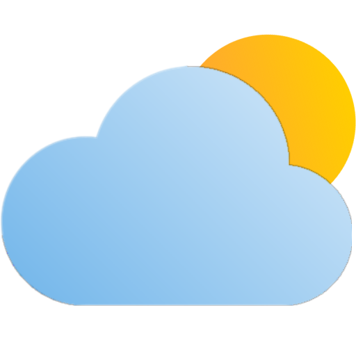 | <a href="https://www.flaticon.com/free-icons/cloudy" title="cloudy icons">Cloudy icons created by berkahicon - Flaticon</a> <a href="https://www.flaticon.com/free-icons/gradient" title="gradient icons">Gradient icons created by jeremie ROBERRINI-NEVEU - Flaticon</a>|
| 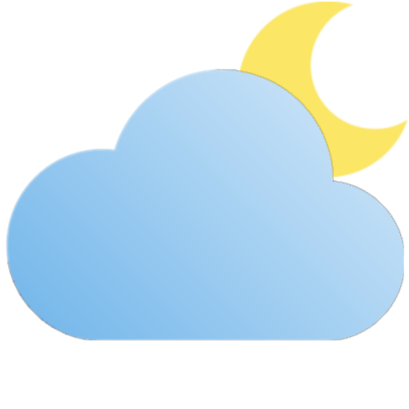 | <a href="https://www.flaticon.com/free-icons/cloudy" title="cloudy icons">Cloudy icons created by berkahicon - Flaticon</a> <a href="https://www.flaticon.com/packs/weather-app-8" title="color fill">Color fill created by Arkinasi - Flaticon</a>|
| 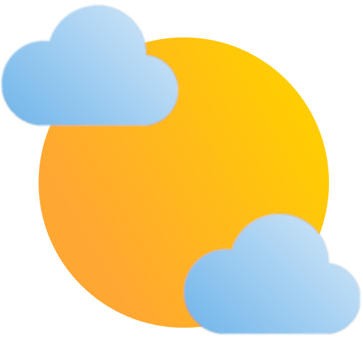 | <a href="https://www.flaticon.com/free-icons/cloudy" title="cloudy icons">Cloudy icons created by berkahicon - Flaticon</a> <a href="https://www.flaticon.com/free-icons/gradient" title="gradient icons">Gradient icons created by jeremie ROBERRINI-NEVEU - Flaticon</a>|
| 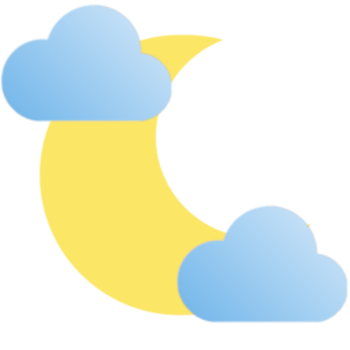 | <a href="https://www.flaticon.com/free-icons/cloudy" title="cloudy icons">Cloudy icons created by berkahicon - Flaticon</a> <a href="https://www.flaticon.com/packs/weather-app-8" title="color fill">Color fill created by Arkinasi - Flaticon</a>|
|  | <a href="https://www.flaticon.com/free-icons/cloudy" title="cloudy icons">Cloudy icons created by berkahicon - Flaticon</a>|
| 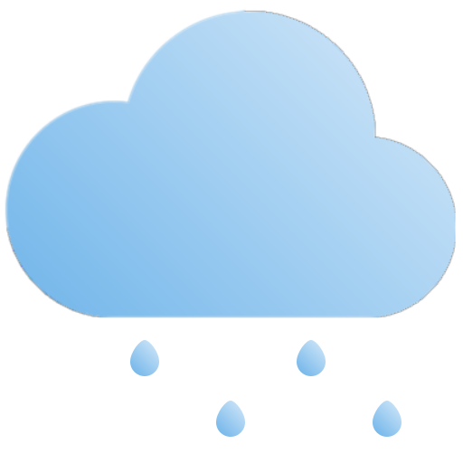 | <a href="https://www.flaticon.com/free-icons/rainy" title="rainy icons">Rainy icons created by berkahicon - Flaticon</a>|
| 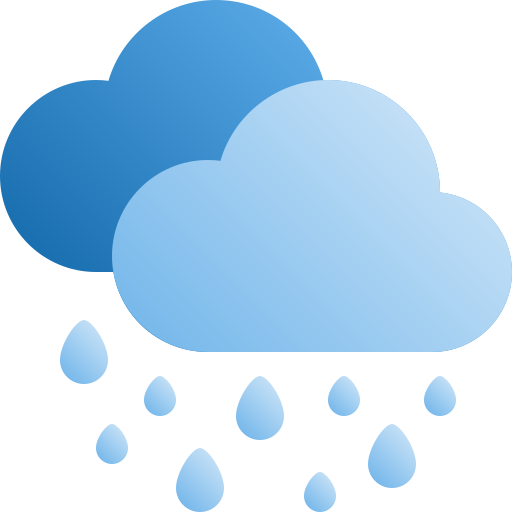 | <a href="https://www.flaticon.com/free-icons/rainy" title="rainy icons">Rainy icons created by berkahicon - Flaticon</a>|
| 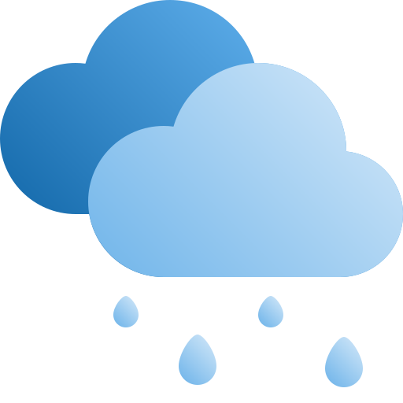 | <a href="https://www.flaticon.com/free-icons/rainy" title="rainy icons">Rainy icons created by berkahicon - Flaticon</a>|
|  |<a href="https://www.flaticon.com/free-icons/thunderstorm" title="thunderstorm icons">Thunderstorm icons created by berkahicon - Flaticon</a>|
| 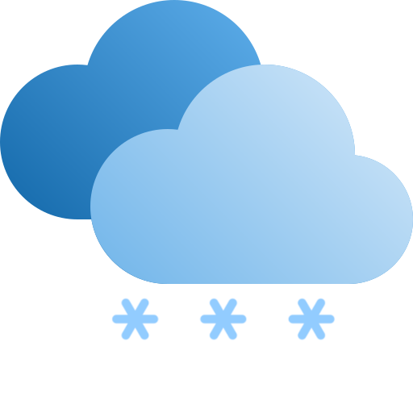 |<a href="https://www.flaticon.com/free-icons/snow" title="snow icons">Snow icons created by berkahicon - Flaticon</a>|
| 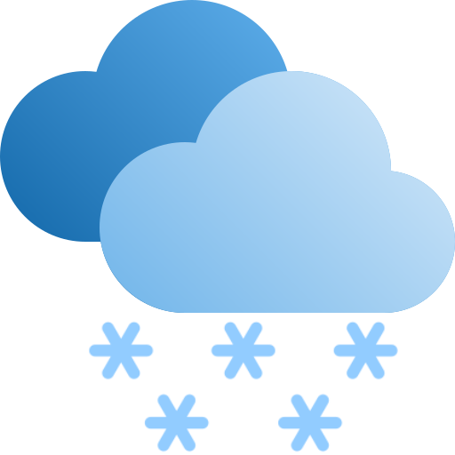 |<a href="https://www.flaticon.com/free-icons/snow" title="snow icons">Snow icons created by berkahicon - Flaticon</a>|
| 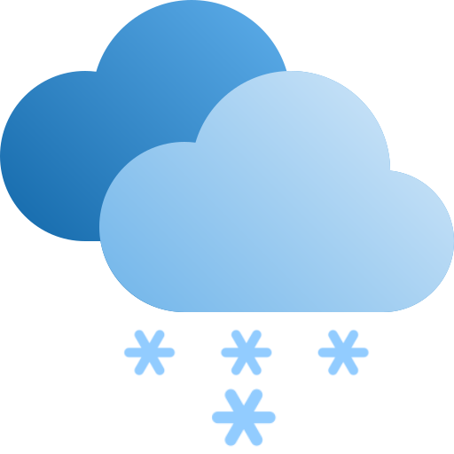 |<a href="https://www.flaticon.com/free-icons/snow" title="snow icons">Snow icons created by berkahicon - Flaticon</a>|
| 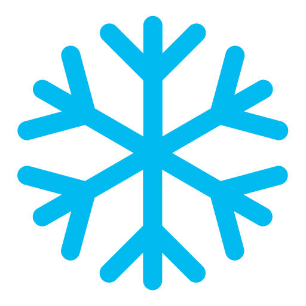 |<a href="https://www.flaticon.com/packs/weather-app-8" title="snow icons">Snow icons created by Arkinasi - Flaticon</a>|
| 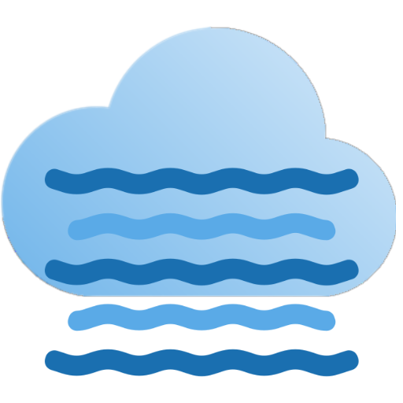 |<a href="https://www.flaticon.com/free-icons/cloudy" title="cloudy icons">Cloudy icons created by berkahicon - Flaticon</a> <a href="https://www.flaticon.com/free-icons/mist" title="mist icons">Mist icons created by Good Ware - Flaticon</a>|
| 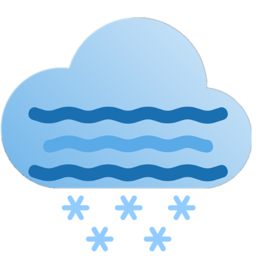 |<a href="https://www.flaticon.com/free-icons/cloudy" title="cloudy icons">Cloudy icons created by berkahicon - Flaticon</a> <a href="https://www.flaticon.com/free-icons/mist" title="mist icons">Mist icons created by Good Ware - Flaticon</a> <a href="https://www.flaticon.com/free-icons/snow" title="snow icons">Snow icons created by berkahicon - Flaticon</a>||
|  |<a href="https://www.flaticon.com/free-icons/sunset" title="sunset icons">Sunset icons created by Icon Hubs - Flaticon</a>|
|  |<a href="https://www.flaticon.com/free-icons/sunset" title="sunset icons">Sunset icons created by Icon Hubs - Flaticon</a>|
|  |<a href="https://www.flaticon.com/free-icons/observe" title="observe icons">Observe icons created by meaicon - Flaticon</a>|

Note: moon-phase icons (`firstquarter`, `fullmoon`, `lastquarter`, `newmoon`,
`waningcrescent`, `waninggibbous`, `waxingcrescent`, `waxinggibbous`) were
never listed in this table in the upstream project this was forked from - if
you know their source, please open a PR to add proper attribution.
