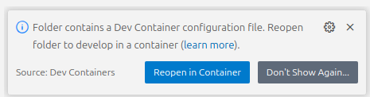

# Development Containers

Development containers (dev containers) provide isolated, reproducible environments for software development. They allow you to define all dependencies, tools, and configurations in a container, ensuring consistency across different machines.
For this project two different devcontainers setups are provided as mocking the display involves some display setup.

## Requirements

- **Docker**: You must have Docker installed and running on your host machine. Dev containers use Docker to provide isolated environments.
- **Compatible Editor**: Use an editor with dev container support, such as Visual Studio Code.

## How to Use

1. **Open the Project**: Launch your workspace in a compatible editor (currently tested on VS Code) with dev container support.

2. **Automatic Setup**: The editor should detect the devcontainer setup and prompt you to reopen the project. If this is not the case use open a remote window in the lower left corner as described [here](https://code.visualstudio.com/docs/devcontainers/containers#_quick-start-open-an-existing-folder-in-a-container).
3. **Container set up** The devcontainer will take care to set up all dependencies and tools required for development.

4. **Run and Debug** After the setup is complete the server can be started using the provided run and debug configuration "Debug Inky". This will run a development server locally and prompt you to open the browser to test the result.

## Limitations

As there is no real hardware when running in the devcontainer the calls to the screen need to be mocked.
In the configuration a `"mock": true` parameter is used to tell the inky library do not use a real screen.
To display the image the inky library provides this mock interface that generates a window to simulate the display.

The window to simulate the display does not work currently as the image refresh is not happening in the main thread.
As a workaround image refresh calls are not send to the library if `"mock": true`  is set.
The current image file and log output can be used to estimate what is happening during local development.