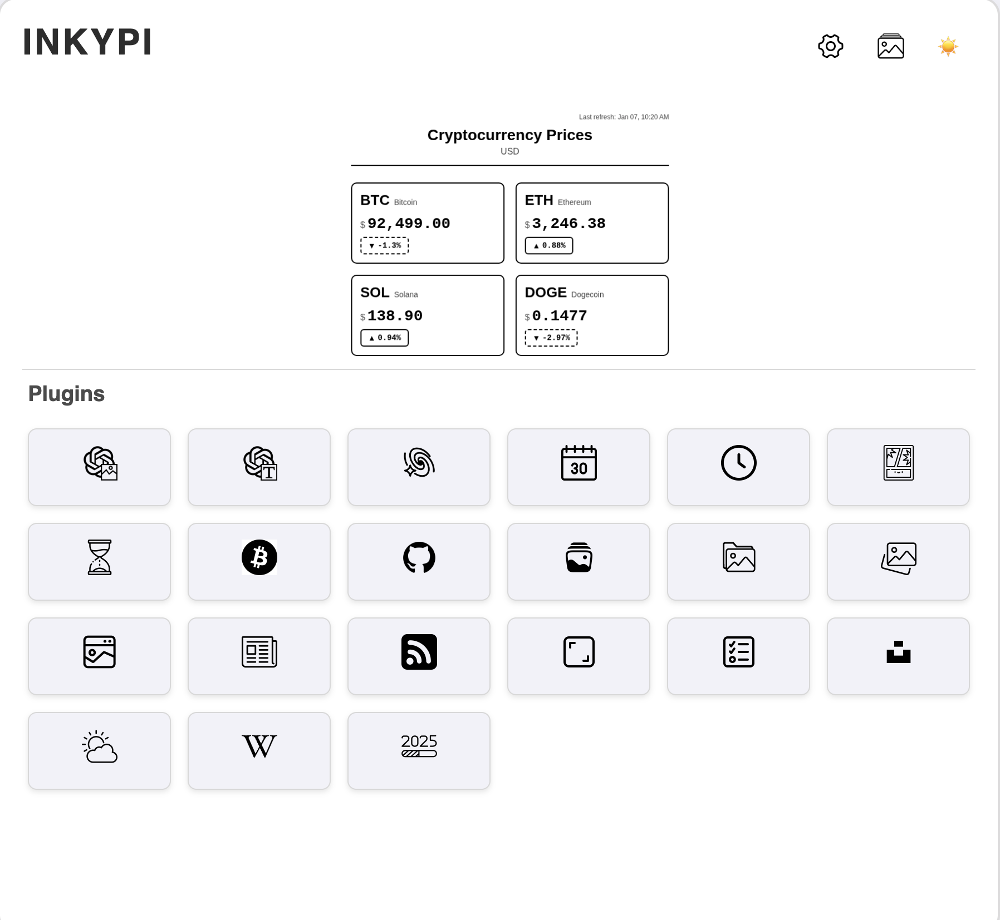

# Cryptocurrency Price Plugin

Display real-time cryptocurrency prices for Bitcoin (BTC), Ethereum (ETH), Solana (SOL), and Dogecoin (DOGE) on your InkyPi display.

## Screenshot

2-column grid layout displaying BTC, ETH, SOL, and DOGE with 24h price changes on e-ink display.

## Features

- Real-time price data from CoinGecko API (free, no API key required)
- Support for multiple cryptocurrencies: BTC, ETH, SOL, DOGE
- Multiple fiat currency options: USD, EUR, GBP, JPY, CNY
- 24-hour price change percentage with visual indicators
- 2-column grid layout to display all 4 cryptocurrencies at once
- High-contrast design optimized for black & white e-ink displays
- Customizable display options
- Clean, readable layout with responsive sizing

## Configuration

### Available Settings

1. **Cryptocurrency Selection**
   - Choose which cryptocurrencies to display
   - Options: Bitcoin (BTC), Ethereum (ETH), Solana (SOL), Dogecoin (DOGE)
   - You can select any combination (recommended: all 4 for optimal grid layout)

2. **Currency**
   - Select your preferred fiat currency
   - Options: USD ($), EUR (€), GBP (£), JPY (¥), CNY (¥)
   - Default: USD

3. **Display 24h Change**
   - Show or hide 24-hour price change percentage
   - Optimized for black & white e-ink displays with border styles:
     - Solid border ▲ for price increase
     - Dashed border ▼ for price decrease
     - Dotted border — for no change
   - High-contrast black text on white background
   - Default: Enabled

4. **Display Refresh Time**
   - Show or hide last refresh timestamp
   - Default: Enabled

## API Information

This plugin uses the CoinGecko API to fetch cryptocurrency prices:
- **API**: CoinGecko Free API (no authentication required)
- **Rate Limits**: Generous free tier limits
- **Data Updates**: Real-time price data with 24-hour change

## Display Layout

The plugin uses a **2-column grid layout** that displays cryptocurrencies in a compact card format:

**Layout Features:**

- 2 cryptocurrencies per row (4 total fit perfectly on screen)
- Each card shows:
  - Cryptocurrency symbol (bold) and full name
  - Current price in selected currency
  - 24-hour price change percentage with border-style indicators (if enabled)
  - Arrow symbols (▲▼—) for visual clarity
- Header with title and currency type
- Last refresh time in top-right corner (if enabled)

**E-Ink Optimization:**

- Pure black & white design for maximum contrast
- No color backgrounds (optimized for monochrome displays)
- Border styles (solid/dashed/dotted) differentiate price movements
- Text uses opacity variations for visual hierarchy

## Notes

- The plugin automatically formats prices based on their value:
  - Large values (>$1000): 2 decimal places with comma separators
  - Medium values ($1-$1000): 2 decimal places
  - Small values ($0.01-$1): 4 decimal places
  - Very small values (<$0.01): 8 decimal places

- The 2-column grid layout is optimized for displaying 4 cryptocurrencies simultaneously

- The layout is responsive and includes special styling for smaller screens (height < 400px)

- Refresh rate depends on your InkyPi refresh schedule settings

- For best results on e-ink displays, the plugin uses high-contrast black & white styling instead of colors

## Troubleshooting

If prices are not displaying:
1. Check your internet connection
2. Verify the CoinGecko API is accessible from your network
3. Check the InkyPi logs for error messages

## Icon

The plugin includes a cryptocurrency-themed icon (`icon.png`).

## Future Enhancements

Potential future features:

- Additional cryptocurrency options (e.g., Cardano, Ripple, Polkadot)
- Price charts/graphs
- Market cap information
- Trading volume data
- Custom refresh intervals per cryptocurrency
- Price alerts/notifications
- Historical price trends
